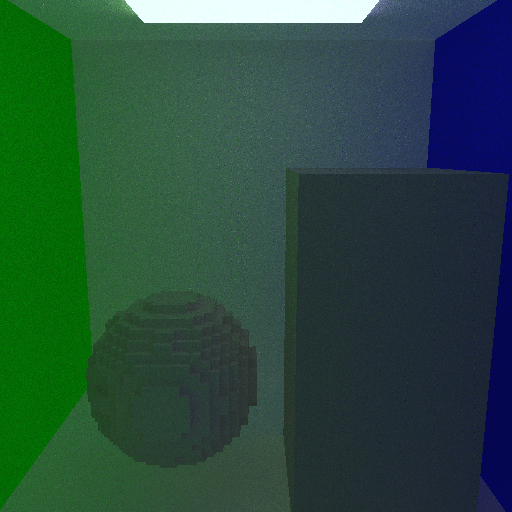
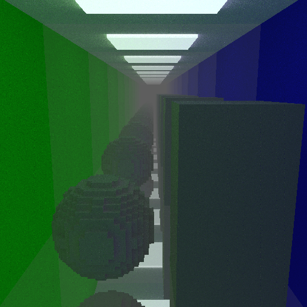
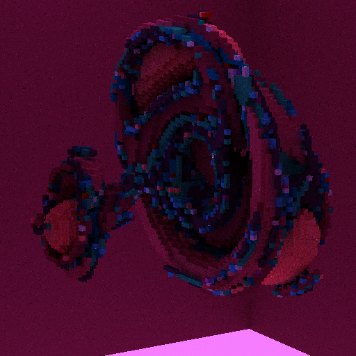

[](https://github.com/platonvin/RaVE/actions/workflows/c-cpp.yml)

# RaVE
multithreaded simd Raytracer for Voxel Engines

## Overview
C99 sse4 + pthreads CPU grid-aligned voxel raytracer created for internal needs of Lum engine

#### screenshots




## Integration
#define every RAVE_* define you need before any of raytracer.* files included

* Include **raytracer.h** wherever you need
* Compile **raytracer.c** (if using any defines, make sure they are defined)
* Link with compiled object file

You may also just compile one of your objects files with raytracer.c included, just make sure that you link with only one implementation

* ## #Defines
    to use custom voxel type instead of uint8_t use
    ```c
    #define RAVE_CUSTOM_VOXEL_TYPE custom_voxel_type //uint8_t is defualt
    #include "raytracer.h"
    ```

    to disable SIMD use 
    ```C
    #define RAVE_NO_SIMD
    #include "raytracer.h"
    ```

## Integration
you need to implement all of the following functions in your code to make RaVE be able to interact with your voxel engine:
```C
rave_voxel rave_get_voxel(int x, int y, int z);
rave_vec3  rave_get_ray_pos(int local_x, int local_y, int local_z);
rave_vec3  rave_get_ray_dir(int local_x, int local_y, int local_z);
void       rave_store_light(int local_x, int local_y, int local_z, rave_vec3 light);
Material   rave_get_material(rave_voxel voxel);
```

Also, create and set following variables
```C
uint32_t max_steps; //steps taken before no-hit return
uint32_t max_reflections; //typically 7 is enough
rave_voxel rave_empty_voxel; //typically you would want it to be 0
```

**rave_get_voxel(x,y,z)** should return voxel in (x,y,z) position in voxel world space.

**rave_get_material(voxel)** should return voxel's material

**Material** represents simple reflectance distribution function, with 3-float color, float emmitance and float roughness parameters

use **rave_dispatch(int count_x, int count_y, int count_z)** to do calculations. This will trace count_x * count_y * count_z rays. Every ray will get its origin via **rave_get_ray_pos(x,y,z)**, direction via **rave_get_ray_dir(x,y,z)** and will store raytraced light via **rave_store_light(x,y,z)**

*typically you will only need one or two dimensions for dispatch, but third one can be used for multisampling*

## Examples
see **tests/test.c** (Cornell box) and **tests/fractal.c** (weirdly-colored voxelized Julia set)
You can build them with Make (make test / make fractal)

## License
MIT
